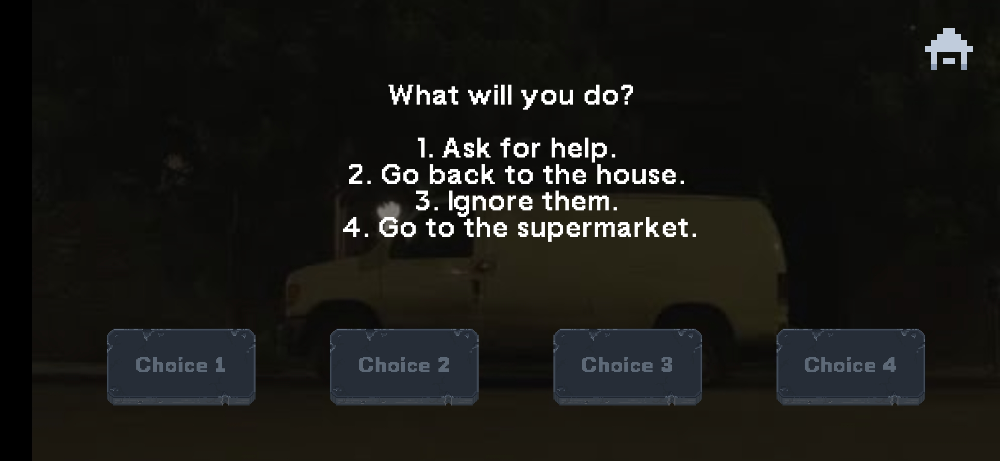

# 🧟‍♂️ Zombie Evasion

**Zombie Evasion** is a decision-based Android game built with **Android Studio**, where every choice could mean life or death.  
In the middle of a zombie apocalypse, your goal is simple — **survive and escape by making the right decisions**.

## ✨ Features

- Immersive story-driven gameplay
- Multiple decision paths leading to different outcomes
- Replayability with alternate endings
- Simple and intuitive UI

## 📸 Screenshots

  
*Main Menu*

  
  
  
*Gameplay sequences — make decisions, explore, and face the consequences.*

  
*One of the possible endings*

## 📱 Installation

1. Clone this repository:
   ```bash
   git clone https://github.com/Aishie123/Zombie-Evasion.git
